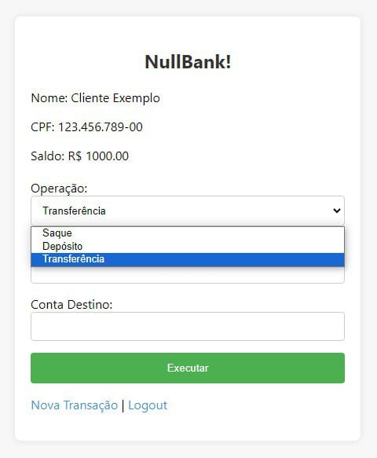
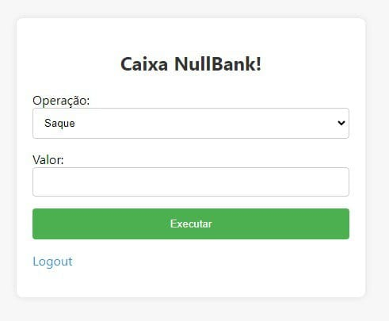

<h1>NullBank</h1>
<h2>Sobre o projeto</h2>
<h3>Visão geral</h3>

O projeto foi desenvolvido como parte das atividades práticas da disciplina de Banco de Dados da Universidade Federal do Ceará, campus Sobral, sob a orientação do professor Fernando de Almeida. A estrutura do banco de dados, definida por este script MySQL, reflete a aplicação concreta dos conceitos discutidos em sala de aula durante o semestre.

<h3>Objetivos</h3>
<ul>
  <li> Cadastrar os usuários do banco </li>
  <li> Permitir que usuários cadastrados como cliente realize operações em sua conta. Exemplo: Saque, depósito, transferência e estorno. </li>
  <li> Permitir que usuários cadastrados como funcionário realize operações de acordo com suas funções no banco. Exemplo: Gerente, caixa, atendente, DBA.</li>
</ul>

 
  
  
  
  
  
  
  
